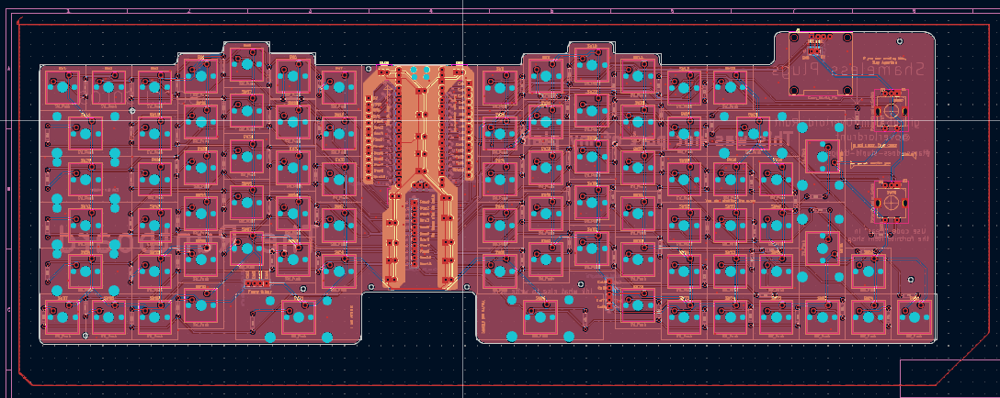

# Runtboard - The custom keyboard made by Taran Mittal/Overlord Runt
\
\
\

## What this is
The Runtboard is a custom keyboard that I designed and coded. It has 83 keys, 2 encoders, 17 LEDs, and an OLED SSD1306 screen. I designed it to have a split keyboard style with keys split down the middle but intentionally left it stuck together to have easier firmware.\
\
I spent a total of rougly 70 hours on this project, from intial designs, pcb, case, and finally firmware. Before reaching this final design, I went through about 3 different variations going back and forth with the pcb and case.\
The Runtboard has 2 layers, one with your regular keyboard layout and one that changes the functions of the encoders. I hope you like the design and you are free to make it yourself if you have a big enough 3d printer.

## Schematic
### Here are the images for my schematic
\
\
\

The header pins are there to make it easier for my wires to reach the pico without having to do funny stuff with the routing and microcontroller. It in a way gives me a third layer to use for connections, which made my life way easier when designing this board.

### The Matrix
You may notice that my matrix looks a bit funny. This is because I overcomplicated it in order to give myself an extra 2 pins to use. By removing 8 columns and adding 6 rows, I gave myself an extra 2 pins that I used to add an extra encoder.

## PCB
### Here are images for my pcb
\
\

This is what my pcb looks like. It has a basic silkscreen but i drew all of it on kicad no figma or anything.

### Silkscreen Stuff
\
\
\

On my silkscreen i have bob, the decapitated stick figure. I also have a bunch of anime references and some plugs of my socials and stuff. You should join #taran-does-stupid-things btw. its super cool. run /Darren in slack to join

## Case
I spent a lot of time designing my case(upward of 40 hours) and hope you like the design.

\

## Resources used:
Joe scotto Youtube channel\
Qmk Guides\
Ai03 plate generator\
keyboard layout editor
